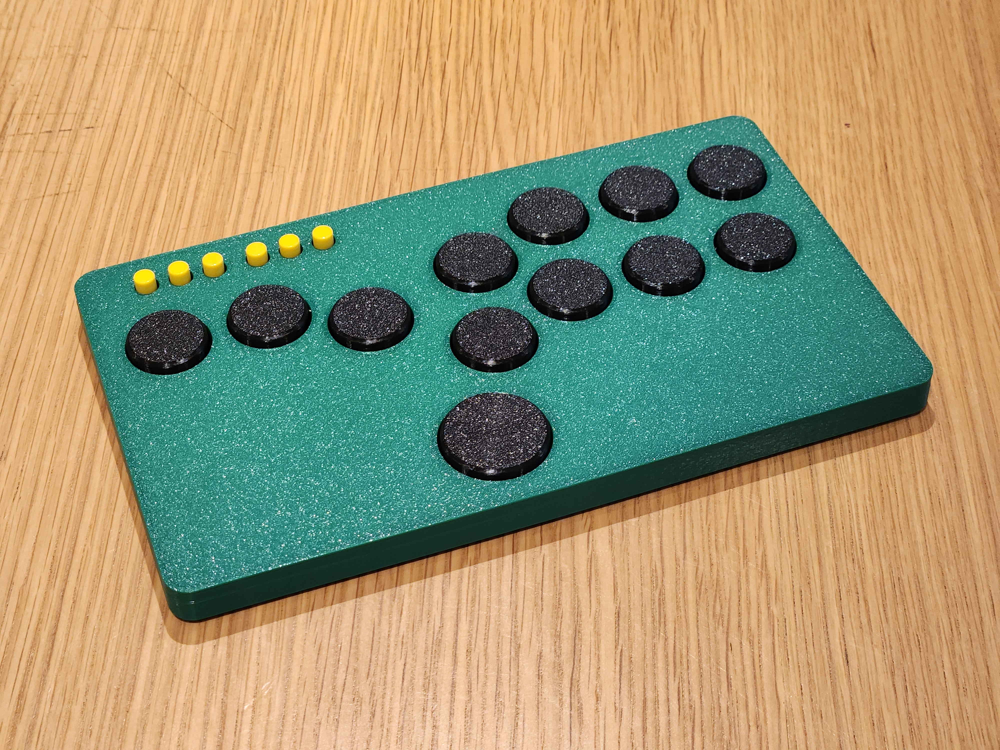

# Flatbox remix
This is a remix of the Flatbox cases by jfedor and fits the rev4 or rev5 PCB without modification.

Parts required for a full assembly:
- 1x case
- 1x bottom plate
- 12x choc v1 compatible buttons (1 big, 11 small), I recommend the Bridget buttons from SGFDevices 
  **Please keep in mind that the caps will be flush with the top of the case once depressed**
- 7x M3x6 countersunk screws 
  https://shop4fasteners.co.uk/socket-head-csk-screws-bzp-m3-x-6mm.html
- 6x 12mm rubber feet/bumpons - The extrusion is 0.6mm x 12.6mm 
  https://www.ebay.co.uk/itm/202803190983
- 6x A56 caps for option buttons for 6x6x7 or 6x6x8 round head tactile push buttons 
  https://www.ebay.co.uk/itm/233216080460

Depending on your printer and settings, you can print all parts without supports. 

I recomended supports with bottom plate for the feet extrusions, and the USB-C port on the case can also use some with the bridge, but this isn't required.

References:
- [jfedor Flatbox](https://github.com/jfedor2/flatbox)
- [SGFDevices Bridget](https://github.com/sgfdevices/Bridget)
